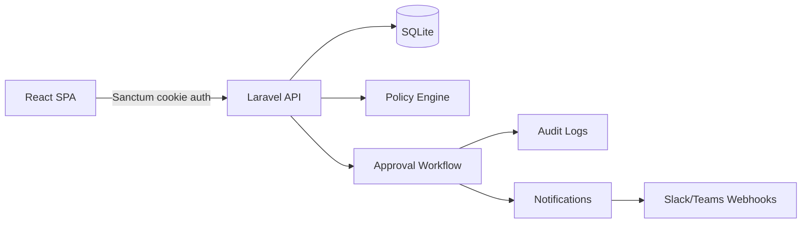

# HR Dashboard - Enterprise Leave Management Platform

End-to-end full-stack application for leave management with advanced HR workflow automation.

Production-style portfolio project focused on enterprise workflow modeling, role-based authorization, and a polished full-stack developer experience.

- Backend: Laravel 12 REST API + Sanctum SPA authentication
- Frontend: React 19 (Vite) + TailwindCSS + Recharts
- Database: SQLite (default)
- Deployment: Local, Docker, CI-ready

## Public Demo (GitHub)

Use this section when publishing the project publicly.

- Repository visibility: Public
- Live demo (frontend): https://hr-dashboard-three-mauve.vercel.app/
- API base URL (backend): add your deployed API URL here

Public-safe checklist:

- Keep `backend/.env` private (never commit real secrets)
- Keep webhook values private (`SLACK_LEAVE_UPDATES_WEBHOOK_URL`, `TEAMS_LEAVE_UPDATES_WEBHOOK_URL`)
- Keep framework secrets private (`APP_KEY`, database credentials, tokens)
- Commit only `backend/.env.example` with placeholder values

Suggested README snippet after deployment:

```md
## Live Demo

- Frontend: https://hr-dashboard-three-mauve.vercel.app/
- Backend API: https://your-backend-url/api

### Demo Login

- admin@company.test / password123
- hr@company.test / password123
- manager@company.test / password123
- employee@company.test / password123
```

## Implemented Feature Set

### Authentication and Security

- Sanctum cookie/session authentication with CSRF protection
- Login throttling (rate-limited by IP + email)
- Security headers middleware (X-Frame-Options, no-sniff, referrer policy, HSTS on secure requests)
- Multi-role authorization model (`employee`, `manager`, `hr`, `admin`)

### Leave Workflow

- Employee leave request creation (full day and half day)
- Multi-level approval flow with approval level checks
- Approval queues filtered by role capabilities (manager/hr/admin)
- Self-approval prevention guard
- Audit trail of status transitions (`leave_request_status_logs`)
- Admin notes on approvals/rejections
- Automatic leave balance consumption on final approval
- Overlap prevention and policy-based validations

### Policy Engine and Calendars

- Department + seniority-aware leave policy resolution with fallback
- Configurable max consecutive days
- Blackout date windows
- Optional half-day enablement by policy
- Business day computation excluding weekends and company holidays
- Team month calendar (grid UI) with approved leave overlays

### Notifications and Integrations

- In-app notifications (list + mark all read)
- Leave status notification dispatch to user
- Optional outbound webhook integration for:
  - Slack incoming webhook
  - Microsoft Teams incoming webhook

### Admin Dashboard

- KPI cards (total, pending, approval rate, average requested days)
- Monthly trend chart (Recharts)
- Pending request management table
- Policy management UI
- Holiday management UI

### Internationalization

- EN/IT locale switch in login and dashboard

### Testing and Quality

- Backend feature tests (`php artisan test`)
- Frontend unit tests (Vitest + Testing Library)
- Frontend linting (ESLint flat config)
- Frontend production build validation
- E2E scaffolding with Playwright (`tests/e2e`)

## Architecture Overview



## Role Matrix

| Role | Create Request | Approve Requests | View Analytics | Manage Policies | Manage Holidays |
| --- | --- | --- | --- | --- | --- |
| employee | Yes | No | No | No | No |
| manager | Yes | Yes (level 1) | Yes | No | No |
| hr | Yes | Yes (level 2) | Yes | Yes | Yes |
| admin | No | Yes (level 3) | Yes | Yes | Yes |

## Demo Walkthrough (GitHub Presentation)

1. Login as `employee@company.test` and create a leave request.
2. Login as `manager@company.test` and approve level 1 pending requests.
3. Login as `hr@company.test` and complete final approval for requests requiring level 2.
4. Login as `admin@company.test` to review global analytics, policies, and holidays.
5. Open the request history and show audit trail progression (created -> approved level 1 -> approved final/rejected).

## Tech Stack

- PHP 8.2+
- Laravel 12 + Sanctum
- React 19 + Vite 8
- TailwindCSS 3
- Axios + React Router
- Recharts
- Vitest + Playwright
- SQLite

## Project Structure

```text
hr-dashboard/
  backend/      # Laravel API
  frontend/     # React SPA
  tools/        # Local Composer PHAR helper
```

## Local Development (without Docker)

### 1) Backend

```powershell
cd backend
copy .env.example .env
php artisan key:generate
php artisan migrate:fresh --seed
php artisan serve
```

Backend URL: http://127.0.0.1:8000

### 2) Frontend

```powershell
cd frontend
npm install
npm run dev
```

Frontend URL: http://localhost:5173

## Demo Credentials

- Admin: `admin@company.test` / `password123`
- HR: `hr@company.test` / `password123`
- Manager: `manager@company.test` / `password123`
- Employee: `employee@company.test` / `password123`
- Employee 2: `employee2@company.test` / `password123`

## Seeded Demo Data

`php artisan migrate:fresh --seed` prepares a showcase-ready dataset with:

- Multiple users across all workflow roles
- Pending requests at different approval stages
- Approved and rejected requests with notes
- Audit logs with actor and level transitions
- Department-specific leave policies and holidays

## API Surface

- `POST /api/login`
- `POST /api/logout`
- `GET /api/me`
- `GET /api/leave-requests`
- `POST /api/leave-requests`
- `PATCH /api/leave-requests/{leaveRequest}/status`
- `GET /api/dashboard/analytics`
- `GET /api/dashboard/calendar?month=YYYY-MM`
- `GET /api/notifications`
- `POST /api/notifications/mark-all-read`
- `GET /api/policies`
- `POST /api/policies`
- `GET /api/holidays`
- `POST /api/holidays`

## Optional Webhook Configuration (Slack/Teams)

In `backend/.env` configure one or both:

```env
SLACK_LEAVE_UPDATES_WEBHOOK_URL=
TEAMS_LEAVE_UPDATES_WEBHOOK_URL=
```

If configured, each leave status transition is sent to the selected channels.

## Test Commands

Backend:

```powershell
cd backend
php artisan test
```

Frontend unit/lint/build:

```powershell
cd frontend
npm run lint
npm run test
npm run build
```

## Portfolio Notes

- Clean separation between domain rules (`LeavePolicyService`), API orchestration (controllers), and presentation (React dashboard).
- Business-focused workflow constraints (approval levels, self-approval prevention, role capabilities).
- Ready for extension with queue workers, SSO, and observability tooling.

Playwright E2E:

```powershell
cd frontend
npx playwright install
npm run test:e2e
```

## Run with Docker

```powershell
docker compose up --build -d
```

Exposed ports:

- Backend API: http://localhost:8000
- Frontend SPA: http://localhost:5173

Stop services:

```powershell
docker compose down
```

## CI

GitHub Actions workflow is included under `.github/workflows/ci.yml` for automated lint/test/build checks.